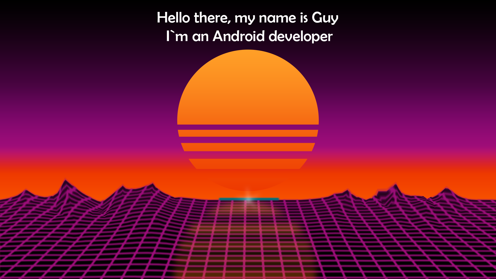

# Hi there! 👋

I'm [Your Name/Username]. I am a passionate programmer and software developer with a focus on [your specialization or area of interest].

## Experience and Skills

- Proficient in [List of programming languages or technologies] with a strong command over [specific skills].
- Worked on [Describe any relevant work experience or projects you have done].
- Achieved [Mention any certifications or notable achievements].

## Projects

Here are some interesting projects I worked on:

- **[Project Name]**: [Brief description of the project, technologies used, and its outcomes].

- **[Project Name]**: [Brief description of the project, technologies used, and its outcomes].

- **[Project Name]**: [Brief description of the project, technologies used, and its outcomes].

## Education

- [Your university/educational institution] - [Year of completion or current year]
- [Describe your specialization or level of education].

## Get in touch

If you are interested in my portfolio or would like to discuss potential collaboration, feel free to reach out. You can connect with me through the following channels:

- LinkedIn: [Your LinkedIn profile]
- Email: avulitski@gmail.com
